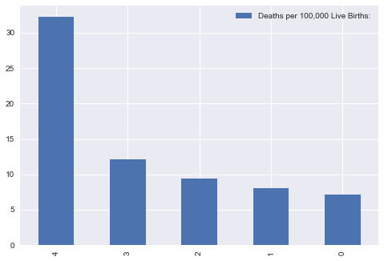
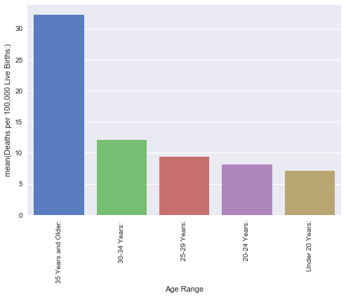
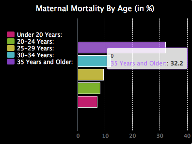

```python
import numpy as np
import pandas as pd
mortality_age = pd.read_csv("mortality_by_age.csv")
mortality_age = mortality_age.sort_values('Deaths per 100,000 Live Births:', ascending = False)[:5]
mortality_age.plot(kind = "bar")

 
```


    <matplotlib.axes._subplots.AxesSubplot at 0x115e65d30>





```python
import pandas as pd
import seaborn as sns
import matplotlib.pyplot as plt
mortality_age = pd.read_csv("mortality_by_age.csv")
mortality_age = mortality_age.sort_values('Deaths per 100,000 Live Births:', ascending = False)[:5]

sns.set(style="darkgrid")
mortality_age_plot = sns.barplot(x=mortality_age["Age Range"], y=mortality_age["Deaths per 100,000 Live Births:"],
                                palette = "muted", order=mortality_age["Age Range"].tolist())
plt.xticks(rotation=90)
plt.show()
```





```python
import pandas as pd
from bokeh.charts import Bar, output_file, show
mortality_age = pd.read_csv("mortality_by_age.csv")
data = {
    'Age Range': mortality_age['Age Range'],
    'Deaths per 100,000 Live Births': mortality_age['Deaths per 100,000 Live Births:']
}

# x-axis labels pulled from the interpreter column, stacking labels from sample column
bar = Bar(data, values='Deaths per 100,000 Live Births', label='Deaths per 100,000 Live Births', stack='Age Range', agg='mean',
          title="Maternal Deaths per 100,000 Live Births", legend='top_right', width=400)

output_file("barchart.html")
show(bar)
```


```python
from IPython.display import Image
Image("figure3_bokeh.png")
```


```python
import pygal
horizontalbar_chart = pygal.HorizontalBar()
horizontalbar_chart.title = 'Maternal Mortality By Age (in %)'
horizontalbar_chart.add('Under 20 Years:', 7.1)
horizontalbar_chart.add('20-24 Years:', 8.1)
horizontalbar_chart.add('25-29 Years:', 9.4)
horizontalbar_chart.add('30-34 Years: ', 12.1)
horizontalbar_chart.add('35 Years and Older:', 32.2)
horizontalbar_chart.render()
```


```python
from IPython.display import Image
Image("figure4_pygal.png")
```





```python

```
