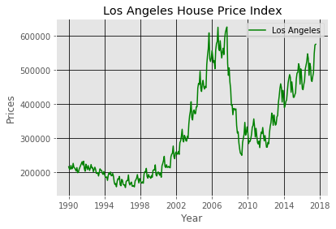

# BIG DATA IN REAL ESTATE ANALYSIS 


```python
import pandas as pd
import numpy as np
from matplotlib import style
from matplotlib import pyplot as plt
style.use('ggplot')


```

### Crime Rate


```python
# Crime rate in Tarzana, CA compared to Calabasas, CA (100 = National Average)
crime_rate = pd.read_csv("2012_Crime_Rate_Indexes.csv",usecols=['2012 Crime Rate Indexes','Tarzana, CA 91356','Calabasas, CA 91302'])
crime_rate
```


<div>
<style>
    .dataframe thead tr:only-child th {
        text-align: right;
    }

    .dataframe thead th {
        text-align: left;
    }

    .dataframe tbody tr th {
        vertical-align: top;
    }
</style>
<table border="1" class="dataframe">
  <thead>
    <tr style="text-align: right;">
      <th></th>
      <th>2012 Crime Rate Indexes</th>
      <th>Tarzana, CA 91356</th>
      <th>Calabasas, CA 91302</th>
    </tr>
  </thead>
  <tbody>
    <tr>
      <th>0</th>
      <td>Total Crime Risk</td>
      <td>108</td>
      <td>24</td>
    </tr>
    <tr>
      <th>1</th>
      <td>Murder Risk</td>
      <td>118</td>
      <td>26</td>
    </tr>
    <tr>
      <th>2</th>
      <td>Rape Risk</td>
      <td>70</td>
      <td>35</td>
    </tr>
    <tr>
      <th>3</th>
      <td>Robbery Risk</td>
      <td>125</td>
      <td>77</td>
    </tr>
    <tr>
      <th>4</th>
      <td>Assault Risk</td>
      <td>127</td>
      <td>48</td>
    </tr>
    <tr>
      <th>5</th>
      <td>Burglary Risk</td>
      <td>55</td>
      <td>27</td>
    </tr>
    <tr>
      <th>6</th>
      <td>Larceny Risk</td>
      <td>73</td>
      <td>9</td>
    </tr>
    <tr>
      <th>7</th>
      <td>Motor Vehicle Theft Risk</td>
      <td>118</td>
      <td>39</td>
    </tr>
  </tbody>
</table>
</div>


```python
#fig1


n_groups = 8

tarzana_crime = crime_rate['Tarzana, CA 91356']
calabasas_crime = crime_rate['Calabasas, CA 91302']


fig, ax = plt.subplots()

index = np.arange(n_groups)
bar_width = 0.35

opacity = 0.4
error_config = {'ecolor': '0.3'}

rects1 = plt.bar(index, tarzana_crime, bar_width,
                 alpha=opacity,
                 color='b',
                 error_kw=error_config,
                 label='Tarzana, CA')

rects2 = plt.bar(index + bar_width, calabasas_crime, bar_width,
                 alpha=opacity,
                 color='r',
                 error_kw=error_config,
                 label='Calabasas,CA')

plt.xlabel(' Level Attained ')
plt.ylabel('Crime Risk Index (100 = National Average')
plt.title('Crime Index')
plt.xticks(index + bar_width / 2, ('Total Crime ', 'Murder ', 'Rape', 'Robbery', 'Assault ','Burglary ', 'Larceny ','Vehicle Theft ' ))
plt.legend()

plt.tight_layout()
plt.show()
```


### Education


```python
# Educational percentage of people in Tarzana, CA compared to Calabasas, CA (Population Age 25+)
education_level = pd.read_csv("education_level_attained.csv",usecols=['2012 Highest Education Level Attained (Population Age 25+)','Tarzana, CA 91356','Calabasas, CA 91302'])
education_level = education_level[0:6]
education_level 
```


<div>
<style>
    .dataframe thead tr:only-child th {
        text-align: right;
    }

    .dataframe thead th {
        text-align: left;
    }

    .dataframe tbody tr th {
        vertical-align: top;
    }
</style>
<table border="1" class="dataframe">
  <thead>
    <tr style="text-align: right;">
      <th></th>
      <th>2012 Highest Education Level Attained (Population Age 25+)</th>
      <th>Tarzana, CA 91356</th>
      <th>Calabasas, CA 91302</th>
    </tr>
  </thead>
  <tbody>
    <tr>
      <th>0</th>
      <td>Did Not Complete High School</td>
      <td>8.3700%</td>
      <td>2.4100%</td>
    </tr>
    <tr>
      <th>1</th>
      <td>Completed High School</td>
      <td>16.7400%</td>
      <td>9.5400%</td>
    </tr>
    <tr>
      <th>2</th>
      <td>Some College</td>
      <td>19.6600%</td>
      <td>17.0200%</td>
    </tr>
    <tr>
      <th>3</th>
      <td>Completed Associate Degree</td>
      <td>7.0100%</td>
      <td>6.1400%</td>
    </tr>
    <tr>
      <th>4</th>
      <td>Completed Bachelors Degree</td>
      <td>28.5600%</td>
      <td>35.300%</td>
    </tr>
    <tr>
      <th>5</th>
      <td>Completed Graduate Degree</td>
      <td>10.500%</td>
      <td>16.2300%</td>
    </tr>
  </tbody>
</table>
</div>


```python
#fig 2

style.use('ggplot')

n_groups = 6

tarzana_education = education_level['Tarzana, CA 91356'].str.replace('00%','')

calabasas_education = education_level['Calabasas, CA 91302'].str.replace('00%','')


fig, ax = plt.subplots()

index = np.arange(n_groups)
bar_width = 0.35

opacity = 0.4
error_config = {'ecolor': '0.3'}

rects1 = plt.bar(index, tarzana_education, bar_width,
                 alpha=opacity,
                 color='b',
                 error_kw=error_config,
                 label='Tarzana, CA')

rects2 = plt.bar(index + bar_width, calabasas_education, bar_width,
                 alpha=opacity,
                 color='r',
                 error_kw=error_config,
                 label='Calabasas,CA')

plt.xlabel(' Level Attained ')
plt.ylabel('% Percentage')
plt.title('Highest Education Level Attained in Tarzana, CA vs. Calabasas, CA')
plt.xticks(index + bar_width / 2, ('No High School', 'High School', 'Some College', 'Associate', 'Bachelors', 'Graduate'))
plt.legend()

plt.tight_layout()
plt.show()
```


### Life quality


```python
# Life quality of people in Tarzana, CA compared to Calabasas, CA 
life_quality = pd.read_csv("2012 Quality of Life Indexes.csv",usecols=['2012 Quality of Life Indexes','Tarzana, CA 91356','Calabasas, CA 91302'])
life_quality

```


<div>
<style>
    .dataframe thead tr:only-child th {
        text-align: right;
    }

    .dataframe thead th {
        text-align: left;
    }

    .dataframe tbody tr th {
        vertical-align: top;
    }
</style>
<table border="1" class="dataframe">
  <thead>
    <tr style="text-align: right;">
      <th></th>
      <th>2012 Quality of Life Indexes</th>
      <th>Tarzana, CA 91356</th>
      <th>Calabasas, CA 91302</th>
    </tr>
  </thead>
  <tbody>
    <tr>
      <th>0</th>
      <td>Quality of Life Index</td>
      <td>199</td>
      <td>199</td>
    </tr>
    <tr>
      <th>1</th>
      <td>Amusement Index</td>
      <td>119</td>
      <td>130</td>
    </tr>
    <tr>
      <th>2</th>
      <td>Culture Index</td>
      <td>142</td>
      <td>129</td>
    </tr>
    <tr>
      <th>3</th>
      <td>Earthquake Index</td>
      <td>362</td>
      <td>318</td>
    </tr>
    <tr>
      <th>4</th>
      <td>Education Index</td>
      <td>134</td>
      <td>132</td>
    </tr>
    <tr>
      <th>5</th>
      <td>Medical Index</td>
      <td>137</td>
      <td>116</td>
    </tr>
    <tr>
      <th>6</th>
      <td>Mortality Index (All Causes)</td>
      <td>144</td>
      <td>95</td>
    </tr>
    <tr>
      <th>7</th>
      <td>Religion Index</td>
      <td>154</td>
      <td>96</td>
    </tr>
    <tr>
      <th>8</th>
      <td>Restaurant Index</td>
      <td>144</td>
      <td>139</td>
    </tr>
    <tr>
      <th>9</th>
      <td>Weather Index</td>
      <td>16</td>
      <td>10</td>
    </tr>
  </tbody>
</table>
</div>


```python
#fig3

n_groups = 10

tarzana_quality = life_quality['Tarzana, CA 91356']
calabasas_quality = life_quality['Calabasas, CA 91302']


fig, ax = plt.subplots()

index = np.arange(n_groups)
bar_width = 0.35

opacity = 0.4
error_config = {'ecolor': '0.3'}

rects1 = plt.bar(index, tarzana_quality, bar_width,
                 alpha=opacity,
                 color='b',
                 error_kw=error_config,
                 label='Tarzana, CA')

rects2 = plt.bar(index + bar_width, calabasas_quality, bar_width,
                 alpha=opacity,
                 color='r',
                 error_kw=error_config,
                 label='Calabasas,CA')

plt.ylabel('Index Score (100 = National Average')
plt.title('Quality of Life in Tarzana, CA vs. Calabasas, CA')
plt.xticks(index + bar_width / 2, ('Life Quality', 'Amusement', 'Culture', 'Earthquake', 'Education', 'Medical', 'Mortality', 'Religion','Restaurant','Weather' ))
plt.legend()

plt.tight_layout()
plt.show()

```


### Air Pollution


```python
# Air Pollution Indexes in Tarzana, CA compared to Calabasas, CA 

air_polution = pd.read_csv("2012_air_polution.csv")
air_polution
```


<div>
<style>
    .dataframe thead tr:only-child th {
        text-align: right;
    }

    .dataframe thead th {
        text-align: left;
    }

    .dataframe tbody tr th {
        vertical-align: top;
    }
</style>
<table border="1" class="dataframe">
  <thead>
    <tr style="text-align: right;">
      <th></th>
      <th>2012 Pollution Indexes</th>
      <th>Tarzana, CA 91356</th>
      <th>Calabasas, CA</th>
    </tr>
  </thead>
  <tbody>
    <tr>
      <th>0</th>
      <td>Air Pollution Index</td>
      <td>119</td>
      <td>115</td>
    </tr>
    <tr>
      <th>1</th>
      <td>Ozone Index</td>
      <td>121</td>
      <td>116</td>
    </tr>
    <tr>
      <th>2</th>
      <td>Lead Index</td>
      <td>101</td>
      <td>105</td>
    </tr>
    <tr>
      <th>3</th>
      <td>Carbon Monoxide Index</td>
      <td>186</td>
      <td>183</td>
    </tr>
    <tr>
      <th>4</th>
      <td>Nitrogen Dioxide Index</td>
      <td>91</td>
      <td>94</td>
    </tr>
    <tr>
      <th>5</th>
      <td>Particulate Matter Index</td>
      <td>106</td>
      <td>103</td>
    </tr>
  </tbody>
</table>
</div>


```python
#fig4

n_groups = 6

tarzana_air_polution = air_polution['Tarzana, CA 91356']
calabasas_air_polution = air_polution['Calabasas, CA']


fig, ax = plt.subplots()

index = np.arange(n_groups)
bar_width = 0.35

opacity = 0.4
error_config = {'ecolor': '0.3'}

rects1 = plt.bar(index, tarzana_air_polution, bar_width,
                 alpha=opacity,
                 color='b',
                 error_kw=error_config,
                 label='Tarzana, CA')

rects2 = plt.bar(index + bar_width,calabasas_air_polution, bar_width,
                 alpha=opacity,
                 color='r',
                 error_kw=error_config,
                 label='Calabasas,CA')

plt.ylabel('Polution Index Score (100 = National Average')
plt.title('Polution Indexes in Tarzana, CA vs. Calabasas, CA')
plt.xticks(index + bar_width / 2, ('Air Pollution', 'Ozone ', 'Lead ', 'Carbon Monoxide', 'Nitrogen Dioxide', 'Particulate Matter' ))
plt.legend()

plt.tight_layout()
plt.show()
```


### Population by Ethnicity and Race


```python
# Population by Race in Tarzana, CA compared to Calabasas, CA 
population_race = pd.read_csv("Population_by_Race.csv")
population_race = population_race[0:8]
population_race 
```


<div>
<style>
    .dataframe thead tr:only-child th {
        text-align: right;
    }

    .dataframe thead th {
        text-align: left;
    }

    .dataframe tbody tr th {
        vertical-align: top;
    }
</style>
<table border="1" class="dataframe">
  <thead>
    <tr style="text-align: right;">
      <th></th>
      <th>2012 Population by Race and Ethnicity</th>
      <th>Tarzana, CA 91356</th>
      <th>Calabasas, CA 91302</th>
    </tr>
  </thead>
  <tbody>
    <tr>
      <th>0</th>
      <td>White Population</td>
      <td>76.9100%</td>
      <td>84.5800%</td>
    </tr>
    <tr>
      <th>1</th>
      <td>Black or African American Population</td>
      <td>4.2100%</td>
      <td>1.5700%</td>
    </tr>
    <tr>
      <th>2</th>
      <td>American Indian and Alaska Native Population</td>
      <td>0.2400%</td>
      <td>0.2000%</td>
    </tr>
    <tr>
      <th>3</th>
      <td>Asian Population</td>
      <td>7.1200%</td>
      <td>8.2300%</td>
    </tr>
    <tr>
      <th>4</th>
      <td>Multi-racial Population</td>
      <td>5.7100%</td>
      <td>3.940%</td>
    </tr>
    <tr>
      <th>5</th>
      <td>Other Population</td>
      <td>5.810%</td>
      <td>1.4900%</td>
    </tr>
    <tr>
      <th>6</th>
      <td>Hispanic</td>
      <td>13.73%</td>
      <td>6.25%</td>
    </tr>
    <tr>
      <th>7</th>
      <td>Non Hispanic</td>
      <td>86.27%</td>
      <td>93.75%</td>
    </tr>
  </tbody>
</table>
</div>


```python
#fig5

n_groups = 8

tarzana_population_race = population_race['Tarzana, CA 91356'].str.replace('%','')

calabasas__population_race = population_race['Calabasas, CA 91302'].str.replace('%','')


fig, ax = plt.subplots()

index = np.arange(n_groups)
bar_width = 0.35

opacity = 0.4
error_config = {'ecolor': '0.3'}

rects1 = plt.bar(index, tarzana_population_race, bar_width,
                 alpha=opacity,
                 color='b',
                 error_kw=error_config,
                 label='Tarzana, CA')

rects2 = plt.bar(index + bar_width, calabasas__population_race, bar_width,
                 alpha=opacity,
                 color='r',
                 error_kw=error_config,
                 label='Calabasas,CA')

plt.xlabel('Race and Ethnicity ')
plt.ylabel('Population by Race and Ethnicity')
plt.title(' Population by Race and Ethnicity in Tarzana, CA vs. Calabasas, CA')
plt.xticks(index + bar_width / 2, ('White', 'African American ', 'American Indian', 'Asian', 'Multi-racial ', 'Other', 'Hispanic', 'Non Hispanic'))
plt.legend()

plt.tight_layout()
plt.show()
```


### Population Growth


```python
# Population change since 1990 in Tarzana, CA compared to Calabasas, CA 
population_growth = pd.read_csv("2012_population_growth.csv")
population_growth

```


<div>
<style>
    .dataframe thead tr:only-child th {
        text-align: right;
    }

    .dataframe thead th {
        text-align: left;
    }

    .dataframe tbody tr th {
        vertical-align: top;
    }
</style>
<table border="1" class="dataframe">
  <thead>
    <tr style="text-align: right;">
      <th></th>
      <th>2012 Population Growth and Population Statistics</th>
      <th>Tarzana, CA 91356</th>
      <th>Calabasas, CA 91302</th>
    </tr>
  </thead>
  <tbody>
    <tr>
      <th>0</th>
      <td>Total Population</td>
      <td>30,133</td>
      <td>27,131</td>
    </tr>
    <tr>
      <th>1</th>
      <td>Square Miles</td>
      <td>7.44</td>
      <td>31.67</td>
    </tr>
    <tr>
      <th>2</th>
      <td>Population Density</td>
      <td>4,048.10</td>
      <td>856.60</td>
    </tr>
    <tr>
      <th>3</th>
      <td>1990 Population</td>
      <td>25,366</td>
      <td>19,822</td>
    </tr>
    <tr>
      <th>4</th>
      <td>2000 Population</td>
      <td>28,981</td>
      <td>25,297</td>
    </tr>
    <tr>
      <th>5</th>
      <td>2010 Population</td>
      <td>29,764</td>
      <td>26,767</td>
    </tr>
    <tr>
      <th>6</th>
      <td>5 Year Population Projection (2017)</td>
      <td>30,689</td>
      <td>27,636</td>
    </tr>
    <tr>
      <th>7</th>
      <td>Population Change Since 1990</td>
      <td>18.79%</td>
      <td>36.88%</td>
    </tr>
    <tr>
      <th>8</th>
      <td>Population Change Since 2000</td>
      <td>3.97%</td>
      <td>7.25%</td>
    </tr>
    <tr>
      <th>9</th>
      <td>Population Change Since 2010</td>
      <td>1.24%</td>
      <td>1.36%</td>
    </tr>
    <tr>
      <th>10</th>
      <td>Median Age</td>
      <td>42.90</td>
      <td>43.40</td>
    </tr>
  </tbody>
</table>
</div>


```python
#fig6

n_groups = 3

population_change = population_growth [7:10]

tarzana_population_change = population_change['Tarzana, CA 91356'].str.replace('%','')

calabasas_population_change = population_change['Calabasas, CA 91302'].str.replace('%','')


fig, ax = plt.subplots()

index = np.arange(n_groups)
bar_width = 0.35

opacity = 0.4
error_config = {'ecolor': '0.3'}

rects1 = plt.bar(index, tarzana_population_change, bar_width,
                 alpha=opacity,
                 color='b',
                 error_kw=error_config,
                 label='Tarzana, CA')

rects2 = plt.bar(index + bar_width, calabasas_population_change, bar_width,
                 alpha=opacity,
                 color='r',
                 error_kw=error_config,
                 label='Calabasas,CA')

plt.ylabel('Population Growth Percentages')
plt.title(' Population Growth in Tarzana, CA vs. Calabasas, CA')
plt.xticks(index + bar_width / 2, ('Population Change Since 1990', 'Population Change Since 2000 ', 'Population Change Since 2010'))
plt.legend()

plt.tight_layout()
plt.show()
```


### Family Household


```python
# Family household in Tarzana, CA compared to Calabasas, CA 
family_hh = pd.read_csv("2012_family_household.csv")
family_hh
```


<div>
<style>
    .dataframe thead tr:only-child th {
        text-align: right;
    }

    .dataframe thead th {
        text-align: left;
    }

    .dataframe tbody tr th {
        vertical-align: top;
    }
</style>
<table border="1" class="dataframe">
  <thead>
    <tr style="text-align: right;">
      <th></th>
      <th>2012 Household Family Statistics</th>
      <th>Tarzana, CA 91356</th>
      <th>Calabasas, CA 91302</th>
    </tr>
  </thead>
  <tbody>
    <tr>
      <th>0</th>
      <td>Family Households(HH)</td>
      <td>64.9500%</td>
      <td>76.8900%</td>
    </tr>
    <tr>
      <th>1</th>
      <td>Non-Family Households(HH)</td>
      <td>35.0500%</td>
      <td>23.1100%</td>
    </tr>
    <tr>
      <th>2</th>
      <td>Married Family HH</td>
      <td>48.9700%</td>
      <td>62.5800%</td>
    </tr>
    <tr>
      <th>3</th>
      <td>Other Family HH</td>
      <td>15.9800%</td>
      <td>14.3100%</td>
    </tr>
    <tr>
      <th>4</th>
      <td>Male Householder, No Wife Present</td>
      <td>4.980%</td>
      <td>3.7800%</td>
    </tr>
    <tr>
      <th>5</th>
      <td>Female Householder, No Husband Present</td>
      <td>10.99%</td>
      <td>10.53%</td>
    </tr>
    <tr>
      <th>6</th>
      <td>with Children Under 18</td>
      <td>20.79%</td>
      <td>30.54%</td>
    </tr>
    <tr>
      <th>7</th>
      <td>with No Children Under 18</td>
      <td>28.18%</td>
      <td>32.04%</td>
    </tr>
    <tr>
      <th>8</th>
      <td>Male Householder, No Wife Present with Childre...</td>
      <td>2.26%</td>
      <td>1.99%</td>
    </tr>
    <tr>
      <th>9</th>
      <td>Male Householder, No Wife Present with No Chil...</td>
      <td>2.72%</td>
      <td>1.78%</td>
    </tr>
    <tr>
      <th>10</th>
      <td>Female Householder, No Husband Present with Ch...</td>
      <td>5.47%</td>
      <td>6.00%</td>
    </tr>
    <tr>
      <th>11</th>
      <td>Female Householder, No Husband Present with No...</td>
      <td>5.52%</td>
      <td>4.53%</td>
    </tr>
    <tr>
      <th>12</th>
      <td>Male Householder</td>
      <td>15.73%</td>
      <td>10.34%</td>
    </tr>
    <tr>
      <th>13</th>
      <td>Female Householder</td>
      <td>19.32%</td>
      <td>12.77%</td>
    </tr>
  </tbody>
</table>
</div>


### Home Values


```python
# Home values in Tarzana, CA compared to Calabasas, CA 
home_values = pd.read_csv("2012_home_values.csv")
home_values
```


<div>
<style>
    .dataframe thead tr:only-child th {
        text-align: right;
    }

    .dataframe thead th {
        text-align: left;
    }

    .dataframe tbody tr th {
        vertical-align: top;
    }
</style>
<table border="1" class="dataframe">
  <thead>
    <tr style="text-align: right;">
      <th></th>
      <th>2012 Homeowner Statistics and Home Values</th>
      <th>Tarzana, CA 91356</th>
      <th>Calabasas, CA 91302</th>
    </tr>
  </thead>
  <tbody>
    <tr>
      <th>0</th>
      <td>Owner Occupied Units</td>
      <td>6,971</td>
      <td>7,719</td>
    </tr>
    <tr>
      <th>1</th>
      <td>Owner Households, With Mortgage Any</td>
      <td>81.15%</td>
      <td>82.12%</td>
    </tr>
    <tr>
      <th>2</th>
      <td>Owner Households, With No Mortgage</td>
      <td>18.85%</td>
      <td>17.88%</td>
    </tr>
    <tr>
      <th>3</th>
      <td>Housing, Median Value Owner Households</td>
      <td>$748,087</td>
      <td>$945,276</td>
    </tr>
    <tr>
      <th>4</th>
      <td>Home Valued at Less than $10,000</td>
      <td>0.11%</td>
      <td>0.22%</td>
    </tr>
    <tr>
      <th>5</th>
      <td>Home Valued at $10,000-$14,999</td>
      <td>0.00%</td>
      <td>0.15%</td>
    </tr>
    <tr>
      <th>6</th>
      <td>Home Valued at $15,000-$19,999</td>
      <td>0.00%</td>
      <td>0.01%</td>
    </tr>
    <tr>
      <th>7</th>
      <td>Home Valued at $20,000-$24,999</td>
      <td>0.00%</td>
      <td>0.00%</td>
    </tr>
    <tr>
      <th>8</th>
      <td>Home Valued at $25,000-$29,999</td>
      <td>0.29%</td>
      <td>0.09%</td>
    </tr>
    <tr>
      <th>9</th>
      <td>Home Valued at $30,000-$34,999</td>
      <td>0.00%</td>
      <td>0.00%</td>
    </tr>
    <tr>
      <th>10</th>
      <td>Home Valued at $35,000-$39,999</td>
      <td>0.00%</td>
      <td>0.00%</td>
    </tr>
    <tr>
      <th>11</th>
      <td>Home Valued at $40,000-$49,999</td>
      <td>0.00%</td>
      <td>0.00%</td>
    </tr>
    <tr>
      <th>12</th>
      <td>Home Valued at $50,000-$59,999</td>
      <td>0.29%</td>
      <td>0.62%</td>
    </tr>
    <tr>
      <th>13</th>
      <td>Home Valued at $60,000-$69,999</td>
      <td>0.00%</td>
      <td>0.97%</td>
    </tr>
  </tbody>
</table>
</div>


```python
home_price = home_values[3:4]
home_price

home_values_tarzana = home_price['Tarzana, CA 91356']
home_values_calabasas= home_price['Calabasas, CA 91302']
print ('Tarzana home value: = ' + home_values_tarzana)
print ('Calabasas home value: = ' + home_values_calabasas)
```

    3    Tarzana home value: = $748,087
    Name: Tarzana, CA 91356, dtype: object
    3    Calabasas home value: = $945,276
    Name: Calabasas, CA 91302, dtype: object


### Income


```python
# Income in Tarzana, CA compared to Calabasas, CA 
hh_income = pd.read_csv("2012_Household_Income.csv",usecols=['2012 Household Income Statistics','Tarzana, CA 91356', 'Calabasas, CA 91302'])
hh_income [0:4]
```


<div>
<style>
    .dataframe thead tr:only-child th {
        text-align: right;
    }

    .dataframe thead th {
        text-align: left;
    }

    .dataframe tbody tr th {
        vertical-align: top;
    }
</style>
<table border="1" class="dataframe">
  <thead>
    <tr style="text-align: right;">
      <th></th>
      <th>2012 Household Income Statistics</th>
      <th>Tarzana, CA 91356</th>
      <th>Calabasas, CA 91302</th>
    </tr>
  </thead>
  <tbody>
    <tr>
      <th>0</th>
      <td>Total Area Household Income</td>
      <td>$197,735,178</td>
      <td>$244,116,491</td>
    </tr>
    <tr>
      <th>1</th>
      <td>Median Household Income</td>
      <td>$89,161</td>
      <td>$150,358</td>
    </tr>
    <tr>
      <th>2</th>
      <td>Average Household Income</td>
      <td>$119,953</td>
      <td>$201,158</td>
    </tr>
    <tr>
      <th>3</th>
      <td>Per Capita Household Income</td>
      <td>$45,458</td>
      <td>$71,575</td>
    </tr>
  </tbody>
</table>
</div>


```python
#fig7
income = hh_income [1:4]

 
objects = ('Median Household Income', 'Average Household Income', 'Per Capita Household Income')
y_pos = np.arange(len(objects))
tarzana_income = income['Tarzana, CA 91356'].str.replace('$','').str.replace(',','')
calabasas_income = income['Calabasas, CA 91302'].str.replace('$','').str.replace(',','')

plt.barh(y_pos, tarzana_income, align='center', alpha=0.5, label='Tarzana,CA')
plt.barh(y_pos, calabasas_income, align='center', alpha=0.5, label='Calabasas,CA')


plt.yticks(y_pos, objects)
plt.xlabel('Income')
plt.title('Household Income Statistics in Tarzana, CA vs. Calabasas, CA')

plt.legend()
plt.show()
```


### Employment Field


```python
# Employment field in Tarzana, CA compared to Calabasas, CA 
employment_field = pd.read_csv("2012_job_field.csv")[1:20]
employment_field 
```


<div>
<style>
    .dataframe thead tr:only-child th {
        text-align: right;
    }

    .dataframe thead th {
        text-align: left;
    }

    .dataframe tbody tr th {
        vertical-align: top;
    }
</style>
<table border="1" class="dataframe">
  <thead>
    <tr style="text-align: right;">
      <th></th>
      <th>2012 Employee Statistics by NAICS Code</th>
      <th>Tarzana, CA 91356</th>
      <th>Calabasas, CA 91302</th>
    </tr>
  </thead>
  <tbody>
    <tr>
      <th>1</th>
      <td>Forestry, Fishing, Hunting, and Agriculture Su...</td>
      <td>0.01%</td>
      <td>0.06%</td>
    </tr>
    <tr>
      <th>2</th>
      <td>Mining</td>
      <td>0.01%</td>
      <td>0.00%</td>
    </tr>
    <tr>
      <th>3</th>
      <td>Utilities</td>
      <td>0.05%</td>
      <td>2.66%</td>
    </tr>
    <tr>
      <th>4</th>
      <td>Construction</td>
      <td>4.54%</td>
      <td>4.30%</td>
    </tr>
    <tr>
      <th>5</th>
      <td>Manufacturing</td>
      <td>1.97%</td>
      <td>9.70%</td>
    </tr>
    <tr>
      <th>6</th>
      <td>Wholesale Trade</td>
      <td>1.34%</td>
      <td>4.37%</td>
    </tr>
    <tr>
      <th>7</th>
      <td>Retail Trade</td>
      <td>7.52%</td>
      <td>11.73%</td>
    </tr>
    <tr>
      <th>8</th>
      <td>Transportation and Warehousing</td>
      <td>1.42%</td>
      <td>1.14%</td>
    </tr>
    <tr>
      <th>9</th>
      <td>Information</td>
      <td>10.50%</td>
      <td>3.42%</td>
    </tr>
    <tr>
      <th>10</th>
      <td>Finance and Insurance</td>
      <td>3.62%</td>
      <td>9.97%</td>
    </tr>
    <tr>
      <th>11</th>
      <td>Real Estate and Rental and Leasing</td>
      <td>2.80%</td>
      <td>3.20%</td>
    </tr>
    <tr>
      <th>12</th>
      <td>Professional, Scientific and Technical Services</td>
      <td>7.79%</td>
      <td>9.48%</td>
    </tr>
    <tr>
      <th>13</th>
      <td>Management of Companies and Enterprises</td>
      <td>1.57%</td>
      <td>2.91%</td>
    </tr>
    <tr>
      <th>14</th>
      <td>Admin, Support, Waste Mgt, Remediation Services</td>
      <td>5.82%</td>
      <td>9.48%</td>
    </tr>
    <tr>
      <th>15</th>
      <td>Educational Services</td>
      <td>10.75%</td>
      <td>3.97%</td>
    </tr>
    <tr>
      <th>16</th>
      <td>Health Care and Social Assistance</td>
      <td>25.94%</td>
      <td>9.54%</td>
    </tr>
    <tr>
      <th>17</th>
      <td>Arts, Entertainment and Recreation</td>
      <td>4.10%</td>
      <td>3.09%</td>
    </tr>
    <tr>
      <th>18</th>
      <td>Accommodation and Food Services</td>
      <td>6.24%</td>
      <td>5.36%</td>
    </tr>
    <tr>
      <th>19</th>
      <td>Other Services (Except Public Administration)</td>
      <td>4.02%</td>
      <td>5.62%</td>
    </tr>
  </tbody>
</table>
</div>


```python
#fig8

objects = (employment_field['2012 Employee Statistics by NAICS Code'])
y_pos = np.arange(len(objects))
field = employment_field['Tarzana, CA 91356'].str.replace('%','')
field2 = employment_field['Calabasas, CA 91302'].str.replace('%','')
plt.figure(figsize=(10,5))
plt.barh(y_pos, field,align='center', alpha=0.5, label='Employment Fields in Tarzana,CA')
plt.barh(y_pos, field2,align='center', alpha=0.5, label='Employment Fields in California,CA')


plt.yticks(y_pos, objects)
plt.xlabel('Percentage')
plt.title('Employee Statistics in Tarzana vs Calabasas')
plt.legend()

plt.show()
```


### Business Field 


```python
# Business fields in Tarzana, CA compared to Calabasas, CA 
business_field = pd.read_csv("2012_establishments .csv")[1:20]
business_field
```


<div>
<style>
    .dataframe thead tr:only-child th {
        text-align: right;
    }

    .dataframe thead th {
        text-align: left;
    }

    .dataframe tbody tr th {
        vertical-align: top;
    }
</style>
<table border="1" class="dataframe">
  <thead>
    <tr style="text-align: right;">
      <th></th>
      <th>2012 Establishments by NAICS Code</th>
      <th>Tarzana, CA 91356</th>
      <th>Calabasas, CA 91302</th>
    </tr>
  </thead>
  <tbody>
    <tr>
      <th>1</th>
      <td>Forestry, Fishing, Hunting, and Agriculture Su...</td>
      <td>0.05%</td>
      <td>0.16%</td>
    </tr>
    <tr>
      <th>2</th>
      <td>Mining</td>
      <td>0.06%</td>
      <td>0.00%</td>
    </tr>
    <tr>
      <th>3</th>
      <td>Utilities</td>
      <td>0.09%</td>
      <td>0.39%</td>
    </tr>
    <tr>
      <th>4</th>
      <td>Construction</td>
      <td>6.19%</td>
      <td>6.32%</td>
    </tr>
    <tr>
      <th>5</th>
      <td>Manufacturing</td>
      <td>2.86%</td>
      <td>4.97%</td>
    </tr>
    <tr>
      <th>6</th>
      <td>Wholesale Trade</td>
      <td>4.28%</td>
      <td>7.72%</td>
    </tr>
    <tr>
      <th>7</th>
      <td>Retail Trade</td>
      <td>11.00%</td>
      <td>10.30%</td>
    </tr>
    <tr>
      <th>8</th>
      <td>Transportation and Warehousing</td>
      <td>1.57%</td>
      <td>1.43%</td>
    </tr>
    <tr>
      <th>9</th>
      <td>Information</td>
      <td>4.71%</td>
      <td>4.06%</td>
    </tr>
    <tr>
      <th>10</th>
      <td>Finance and Insurance</td>
      <td>4.83%</td>
      <td>9.25%</td>
    </tr>
    <tr>
      <th>11</th>
      <td>Real Estate and Rental and Leasing</td>
      <td>5.90%</td>
      <td>6.72%</td>
    </tr>
    <tr>
      <th>12</th>
      <td>Professional, Scientific and Technical Services</td>
      <td>15.17%</td>
      <td>17.46%</td>
    </tr>
    <tr>
      <th>13</th>
      <td>Management of Companies and Enterprises</td>
      <td>0.83%</td>
      <td>0.82%</td>
    </tr>
    <tr>
      <th>14</th>
      <td>Admin, Support, Waste Mgt, Remediation Services</td>
      <td>4.57%</td>
      <td>5.91%</td>
    </tr>
    <tr>
      <th>15</th>
      <td>Educational Services</td>
      <td>2.28%</td>
      <td>1.44%</td>
    </tr>
    <tr>
      <th>16</th>
      <td>Health Cate and Social Assistance</td>
      <td>15.64%</td>
      <td>7.68%</td>
    </tr>
    <tr>
      <th>17</th>
      <td>Arts, Entertainment and Recreation</td>
      <td>7.31%</td>
      <td>6.23%</td>
    </tr>
    <tr>
      <th>18</th>
      <td>Accommodation and Food Services</td>
      <td>5.01%</td>
      <td>2.62%</td>
    </tr>
    <tr>
      <th>19</th>
      <td>Other Services (Except Public Administration)</td>
      <td>7.67%</td>
      <td>6.52%</td>
    </tr>
  </tbody>
</table>
</div>


```python
#fig9

 
objects = (business_field['2012 Establishments by NAICS Code'])
y_pos = np.arange(len(objects))
width = .5
tarzana_business_field = business_field['Tarzana, CA 91356'].str.replace('%','')
calabasas_business_field = business_field['Calabasas, CA 91302'].str.replace('%','')

tarzana_employment_field = employment_field ['Tarzana, CA 91356'].str.replace('%','')
calabasas_employment_field = employment_field ['Calabasas, CA 91302'].str.replace('%','')


plt.barh(y_pos +width, tarzana_business_field, align='center', alpha=0.5, label='Busness Fields in Tarzana,CA')
plt.barh(y_pos +width, calabasas_business_field, align='center', alpha=0.5, label='Business Fields in Calabasas,CA')

plt.barh(y_pos +width, tarzana_employment_field, align='center', alpha=0.5, label='Employment Field in Tarzana,CA')
plt.barh(y_pos +width, calabasas_employment_field, align='center', alpha=0.5, label='Employment Field in Calabasas,CA')


plt.yticks(y_pos, objects)
plt.xlabel('Percentage')
plt.title('Employment Field and Business Statistics in Tarzana, CA vs. Calabasas, CA')

plt.legend()
plt.show()
```


### Public Schools


```python
# Public schools in Tarzana, CA compared to Calabasas, CA 
tarzana_schools = pd.read_csv("tarzana_schools_rating.csv",usecols=['Tarzana, CA 91356 Public Schools','Rating'])[0:5]
tarzana_schools

```


<div>
<style>
    .dataframe thead tr:only-child th {
        text-align: right;
    }

    .dataframe thead th {
        text-align: left;
    }

    .dataframe tbody tr th {
        vertical-align: top;
    }
</style>
<table border="1" class="dataframe">
  <thead>
    <tr style="text-align: right;">
      <th></th>
      <th>Tarzana, CA 91356 Public Schools</th>
      <th>Rating</th>
    </tr>
  </thead>
  <tbody>
    <tr>
      <th>0</th>
      <td>Nestle Avenue Charter School K-5</td>
      <td>7.0</td>
    </tr>
    <tr>
      <th>1</th>
      <td>Tarzana Elementary School K-5</td>
      <td>3.0</td>
    </tr>
    <tr>
      <th>2</th>
      <td>Wilbur Charter For Enriched Academics K-5</td>
      <td>7.0</td>
    </tr>
    <tr>
      <th>3</th>
      <td>Gaspar De Portola Middle School</td>
      <td>6.0</td>
    </tr>
    <tr>
      <th>4</th>
      <td>William Howard Taft Senior High School</td>
      <td>7.0</td>
    </tr>
  </tbody>
</table>
</div>


```python
calabasas_schools = pd.read_csv("calabasas_schools_rating.csv")
calabasas_schools
```


<div>
<style>
    .dataframe thead tr:only-child th {
        text-align: right;
    }

    .dataframe thead th {
        text-align: left;
    }

    .dataframe tbody tr th {
        vertical-align: top;
    }
</style>
<table border="1" class="dataframe">
  <thead>
    <tr style="text-align: right;">
      <th></th>
      <th>Calabasas, CA 91302 Public Schools</th>
      <th>Rating</th>
    </tr>
  </thead>
  <tbody>
    <tr>
      <th>0</th>
      <td>Bay Laurel Elementary School</td>
      <td>8</td>
    </tr>
    <tr>
      <th>1</th>
      <td>Chaparral Elementary School</td>
      <td>9</td>
    </tr>
    <tr>
      <th>2</th>
      <td>Lupin Hill Elementary School</td>
      <td>10</td>
    </tr>
    <tr>
      <th>3</th>
      <td>Round Meadow Elementary School</td>
      <td>8</td>
    </tr>
    <tr>
      <th>4</th>
      <td>Arthur E. Wright Middle School</td>
      <td>8</td>
    </tr>
    <tr>
      <th>5</th>
      <td>Alice C. Stelle Middle School</td>
      <td>8</td>
    </tr>
    <tr>
      <th>6</th>
      <td>Calabasas High School</td>
      <td>7</td>
    </tr>
  </tbody>
</table>
</div>


```python
#fig10

 
objects = ('Elementary School 1','Elementary School 2', 'Elementary School 3', "Middle School", 'High School')
y_pos = np.arange(len(objects))

tarzana_schools = ['7', '3', '7', '6', '7']
calabasas_schools = ['8', '9', '10', '8', '7']


plt.barh(y_pos, tarzana_schools, align='center', alpha=0.5, label='Schools Rating in Tarzana,CA')
plt.barh(y_pos, calabasas_schools, align='center', alpha=0.5, label='chools Rating in Calabasas,CA')

plt.yticks(y_pos, objects)
plt.xlabel('Rating')
plt.title('Schools Rating in Tarzana, CA vs. Calabasas, CA')

plt.legend()
plt.show()
```


```python
#To calculate the tax on your property, multiply the ASSESSED VALUE by the TAX RATE. 
tarzana_house_value = 729000
calabasas_house_value = 859950
tax_rate =1.25
calabasas_property_tax = tax_rate*calabasas_house_value
tarzana_property_tax = tax_rate*tarzana_house_value
print( tarzana_property_tax, calabasas_property_tax)
```

    911250.0 1074937.5


### Houses for Rent


```python
# Houses for rent in Tarzana, CA compared to Calabasas, CA (3bd+ House For Rent (1,500-2,500 Sqft))

tarzana_rent = pd.read_csv("tarzana_rent_vacancy.csv")
tarzana_rent[0:7]
```


<div>
<style>
    .dataframe thead tr:only-child th {
        text-align: right;
    }

    .dataframe thead th {
        text-align: left;
    }

    .dataframe tbody tr th {
        vertical-align: top;
    }
</style>
<table border="1" class="dataframe">
  <thead>
    <tr style="text-align: right;">
      <th></th>
      <th>3bd+ House For Rent (1,500-2,500 Sqft)</th>
      <th>Monthly Price</th>
      <th>Sqft</th>
    </tr>
  </thead>
  <tbody>
    <tr>
      <th>0</th>
      <td>5124 Nestle, Tarzana, CA</td>
      <td>3400.0</td>
      <td>1700.0</td>
    </tr>
    <tr>
      <th>1</th>
      <td>5904 Topeka Dr, Tarzana, CA</td>
      <td>3500.0</td>
      <td>1754.0</td>
    </tr>
    <tr>
      <th>2</th>
      <td>5000 Garden Grove Ave, Tarzana, CA</td>
      <td>3700.0</td>
      <td>1800.0</td>
    </tr>
    <tr>
      <th>3</th>
      <td>5319 Veloz Ave, Tarzana, CA</td>
      <td>3995.0</td>
      <td>1706.0</td>
    </tr>
    <tr>
      <th>4</th>
      <td>5204 Etiwanda, Tarzana, CA</td>
      <td>4500.0</td>
      <td>1917.0</td>
    </tr>
    <tr>
      <th>5</th>
      <td>5312 Amigo Ave, Tarzana, CA</td>
      <td>4875.0</td>
      <td>1937.0</td>
    </tr>
    <tr>
      <th>6</th>
      <td>4933 Lindley Ave, Tarzana, CA</td>
      <td>5500.0</td>
      <td>2051.0</td>
    </tr>
  </tbody>
</table>
</div>


```python
tarzana_rent['Monthly Price'].describe()
```


    count       7.000000
    mean     4210.000000
    std       780.699473
    min      3400.000000
    25%      3600.000000
    50%      3995.000000
    75%      4687.500000
    max      5500.000000
    Name: Monthly Price, dtype: float64


```python
calabasas_rent = pd.read_csv("calabasas_rent_vacancy.csv")
calabasas_rent[0:7]

```


<div>
<style>
    .dataframe thead tr:only-child th {
        text-align: right;
    }

    .dataframe thead th {
        text-align: left;
    }

    .dataframe tbody tr th {
        vertical-align: top;
    }
</style>
<table border="1" class="dataframe">
  <thead>
    <tr style="text-align: right;">
      <th></th>
      <th>3bd+ House For Rent (1,500-2,500 Sqft)</th>
      <th>Monthly Price</th>
      <th>Sqft</th>
    </tr>
  </thead>
  <tbody>
    <tr>
      <th>0</th>
      <td>4346 Oak Glen St, Calabasas, CA</td>
      <td>3200.0</td>
      <td>1594.0</td>
    </tr>
    <tr>
      <th>1</th>
      <td>3200 Gladiola Sta, Calabasas, CA</td>
      <td>3750.0</td>
      <td>2010.0</td>
    </tr>
    <tr>
      <th>2</th>
      <td>4350 Willow Glen St, Calabasas, CA</td>
      <td>3895.0</td>
      <td>1594.0</td>
    </tr>
    <tr>
      <th>3</th>
      <td>26213 Adamor Rd, Calabasas, CA</td>
      <td>3900.0</td>
      <td>1850.0</td>
    </tr>
    <tr>
      <th>4</th>
      <td>2409 Vista Cerritos, Calabasas, CA</td>
      <td>4500.0</td>
      <td>1943.0</td>
    </tr>
    <tr>
      <th>5</th>
      <td>2434 Calle Largo, Calabasas, CA</td>
      <td>4600.0</td>
      <td>1834.0</td>
    </tr>
    <tr>
      <th>6</th>
      <td>3456 Calle Joaquin, Calabasas, CA</td>
      <td>4750.0</td>
      <td>1834.0</td>
    </tr>
  </tbody>
</table>
</div>


```python
#fig11
#Areas compared to rent prices
style.use('ggplot')
plt.plot(tarzana_rent['Monthly Price'], label='Tarzana, CA')
plt.plot(calabasas_rent['Monthly Price'], label='Calabasas, CA')
plt.xlabel("Available Houses For Rent")
plt.ylabel("Price per month ($)")
plt.title('Houses for rent comparison')
plt.legend()
plt.show()
```


```python
#fig12
#Areas compared to rent sqft


a = tarzana_rent['Monthly Price']
b =  tarzana_rent['Sqft']

a2 = calabasas_rent['Monthly Price']
b2 = calabasas_rent['Sqft']

plt.plot(a,b,'g',label='Tarzana')
plt.plot(a2,b2,'c',label='Calabasas')

plt.title('Houses for rent comparison')
plt.ylabel('Prices')
plt.xlabel('Sqft')

plt.legend()

plt.grid(True,color='k')

plt.show()
```


```python
#To get the price per sqft, divide the price of the area by its square footage. 
price_per_sqft_t = tarzana_rent['Monthly Price']/tarzana_sqft
price_per_sqft_c = calabasas_rent['Monthly Price']/calabasas_sqft
print (price_per_sqft_t.describe() , price_per_sqft_c.describe())
```

    count    7.000000
    mean     2.276935
    std      0.269383
    min      1.995439
    25%      2.027778
    50%      2.341735
    75%      2.432098
    max      2.681619
    dtype: float64 count    7.000000
    mean     2.262714
    std      0.273724
    min      1.865672
    25%      2.057818
    50%      2.316006
    75%      2.475859
    max      2.589967
    dtype: float64


```python
# Available houses for sale in Tarzana, CA compared to Calabasas, CA 
tarzana_houses_sale = pd.read_csv("tarzana_houses_for_sale.csv")
tarzana_houses_sale.describe()
```


<div>
<style>
    .dataframe thead tr:only-child th {
        text-align: right;
    }

    .dataframe thead th {
        text-align: left;
    }

    .dataframe tbody tr th {
        vertical-align: top;
    }
</style>
<table border="1" class="dataframe">
  <thead>
    <tr style="text-align: right;">
      <th></th>
      <th>Price</th>
      <th>Sqft</th>
    </tr>
  </thead>
  <tbody>
    <tr>
      <th>count</th>
      <td>7.000000e+00</td>
      <td>7.000000</td>
    </tr>
    <tr>
      <th>mean</th>
      <td>1.014857e+06</td>
      <td>2068.714286</td>
    </tr>
    <tr>
      <th>std</th>
      <td>2.302125e+05</td>
      <td>307.989023</td>
    </tr>
    <tr>
      <th>min</th>
      <td>7.490000e+05</td>
      <td>1600.000000</td>
    </tr>
    <tr>
      <th>25%</th>
      <td>8.555000e+05</td>
      <td>1903.500000</td>
    </tr>
    <tr>
      <th>50%</th>
      <td>9.190000e+05</td>
      <td>2020.000000</td>
    </tr>
    <tr>
      <th>75%</th>
      <td>1.187500e+06</td>
      <td>2298.000000</td>
    </tr>
    <tr>
      <th>max</th>
      <td>1.350000e+06</td>
      <td>2458.000000</td>
    </tr>
  </tbody>
</table>
</div>


```python
calabasas_houses_sale = pd.read_csv("calabasas_houses_for_sale.csv")
calabasas_houses_sale.describe()
```


<div>
<style>
    .dataframe thead tr:only-child th {
        text-align: right;
    }

    .dataframe thead th {
        text-align: left;
    }

    .dataframe tbody tr th {
        vertical-align: top;
    }
</style>
<table border="1" class="dataframe">
  <thead>
    <tr style="text-align: right;">
      <th></th>
      <th>Price</th>
      <th>Sqft</th>
    </tr>
  </thead>
  <tbody>
    <tr>
      <th>count</th>
      <td>7.000000e+00</td>
      <td>7.000000</td>
    </tr>
    <tr>
      <th>mean</th>
      <td>1.108414e+06</td>
      <td>1952.285714</td>
    </tr>
    <tr>
      <th>std</th>
      <td>9.663109e+04</td>
      <td>188.229217</td>
    </tr>
    <tr>
      <th>min</th>
      <td>9.750000e+05</td>
      <td>1600.000000</td>
    </tr>
    <tr>
      <th>25%</th>
      <td>1.037000e+06</td>
      <td>1879.000000</td>
    </tr>
    <tr>
      <th>50%</th>
      <td>1.145000e+06</td>
      <td>1990.000000</td>
    </tr>
    <tr>
      <th>75%</th>
      <td>1.182450e+06</td>
      <td>2096.500000</td>
    </tr>
    <tr>
      <th>max</th>
      <td>1.200000e+06</td>
      <td>2125.000000</td>
    </tr>
  </tbody>
</table>
</div>


```python
#To get the price per sqft, divide the price of the area by its square footage. 
price_per_sqft_t_sale = t_houses_s['Price']/t_houses_s['Sqft']
print (price_per_sqft_t.describe() )
```

    count    7.000000
    mean     2.276935
    std      0.269383
    min      1.995439
    25%      2.027778
    50%      2.341735
    75%      2.432098
    max      2.681619
    dtype: float64


### Future Value


```python
#Calculating the potential future value of the house
import pandas
price_index = pandas.read_csv("houses_price_index_losangeles.csv")
price_index.head()
```


<div>
<style>
    .dataframe thead tr:only-child th {
        text-align: right;
    }

    .dataframe thead th {
        text-align: left;
    }

    .dataframe tbody tr th {
        vertical-align: top;
    }
</style>
<table border="1" class="dataframe">
  <thead>
    <tr style="text-align: right;">
      <th></th>
      <th>Month-Year</th>
      <th>Los Angeles</th>
    </tr>
  </thead>
  <tbody>
    <tr>
      <th>0</th>
      <td>Jan-90</td>
      <td>$215,338</td>
    </tr>
    <tr>
      <th>1</th>
      <td>Feb-90</td>
      <td>$208,399</td>
    </tr>
    <tr>
      <th>2</th>
      <td>Mar-90</td>
      <td>$208,135</td>
    </tr>
    <tr>
      <th>3</th>
      <td>Apr-90</td>
      <td>$219,004</td>
    </tr>
    <tr>
      <th>4</th>
      <td>May-90</td>
      <td>$209,065</td>
    </tr>
  </tbody>
</table>
</div>


```python
#fig14
#Prices growth
price_index = pd.read_csv("houses_price_index_losangeles.csv")
price_index['Los Angeles'] = price_index['Los Angeles'].str.replace('$','').str.replace(',','') 
price_index['Month-Year'] = pd.to_datetime(price_index['Month-Year'], format='%b-%y')

a = price_index['Los Angeles']
b = price_index['Month-Year']

plt.plot(b,a,'g',label='Los Angeles')

plt.title('Los Angeles House Price Index')
plt.ylabel('Prices')
plt.xlabel('Year')

plt.legend()

plt.grid(True,color='k')

plt.show()
```





```python
states_index = pandas.read_csv("HPI_AT_state.csv")
```


```python
style.use('ggplot')

a = states_index['Price']
b = states_index['Year']

plt.plot(b,a,'g',label='California')

plt.title('House Price Index')
plt.ylabel('Prices')
plt.xlabel('Year')

plt.legend()

plt.grid(True,color='k')

plt.show()
```


```python
first = 261.18
last = 645.03
periods = 17
    
def growth_rate(first, last, periods):
    return (last/first)**(1/periods)-1

print ('Housing investment for 20 years had a Growth Rate of {:.2%} '.format(growth_rate(first, last, periods)))
```

    Housing investment for 20 years had a Growth Rate of 5.46% 


```python
ca_index = pandas.read_csv("HPI_AT_state_2010.csv")
```


```python
ca_index
```


<div>
<style>
    .dataframe thead tr:only-child th {
        text-align: right;
    }

    .dataframe thead th {
        text-align: left;
    }

    .dataframe tbody tr th {
        vertical-align: top;
    }
</style>
<table border="1" class="dataframe">
  <thead>
    <tr style="text-align: right;">
      <th></th>
      <th>State</th>
      <th>Year</th>
      <th>Price</th>
    </tr>
  </thead>
  <tbody>
    <tr>
      <th>0</th>
      <td>CA</td>
      <td>2010</td>
      <td>409.94</td>
    </tr>
    <tr>
      <th>1</th>
      <td>CA</td>
      <td>2010</td>
      <td>408.77</td>
    </tr>
    <tr>
      <th>2</th>
      <td>CA</td>
      <td>2010</td>
      <td>410.83</td>
    </tr>
    <tr>
      <th>3</th>
      <td>CA</td>
      <td>2010</td>
      <td>406.23</td>
    </tr>
    <tr>
      <th>4</th>
      <td>CA</td>
      <td>2011</td>
      <td>392.02</td>
    </tr>
    <tr>
      <th>5</th>
      <td>CA</td>
      <td>2011</td>
      <td>385.72</td>
    </tr>
    <tr>
      <th>6</th>
      <td>CA</td>
      <td>2011</td>
      <td>387.13</td>
    </tr>
    <tr>
      <th>7</th>
      <td>CA</td>
      <td>2011</td>
      <td>385.82</td>
    </tr>
    <tr>
      <th>8</th>
      <td>CA</td>
      <td>2012</td>
      <td>381.41</td>
    </tr>
    <tr>
      <th>9</th>
      <td>CA</td>
      <td>2012</td>
      <td>382.22</td>
    </tr>
    <tr>
      <th>10</th>
      <td>CA</td>
      <td>2012</td>
      <td>390.42</td>
    </tr>
    <tr>
      <th>11</th>
      <td>CA</td>
      <td>2012</td>
      <td>398.47</td>
    </tr>
    <tr>
      <th>12</th>
      <td>CA</td>
      <td>2013</td>
      <td>407.44</td>
    </tr>
    <tr>
      <th>13</th>
      <td>CA</td>
      <td>2013</td>
      <td>426.68</td>
    </tr>
    <tr>
      <th>14</th>
      <td>CA</td>
      <td>2013</td>
      <td>450.94</td>
    </tr>
    <tr>
      <th>15</th>
      <td>CA</td>
      <td>2013</td>
      <td>465.99</td>
    </tr>
    <tr>
      <th>16</th>
      <td>CA</td>
      <td>2014</td>
      <td>476.14</td>
    </tr>
    <tr>
      <th>17</th>
      <td>CA</td>
      <td>2014</td>
      <td>488.63</td>
    </tr>
    <tr>
      <th>18</th>
      <td>CA</td>
      <td>2014</td>
      <td>498.98</td>
    </tr>
    <tr>
      <th>19</th>
      <td>CA</td>
      <td>2014</td>
      <td>504.61</td>
    </tr>
    <tr>
      <th>20</th>
      <td>CA</td>
      <td>2015</td>
      <td>508.84</td>
    </tr>
    <tr>
      <th>21</th>
      <td>CA</td>
      <td>2015</td>
      <td>521.50</td>
    </tr>
    <tr>
      <th>22</th>
      <td>CA</td>
      <td>2015</td>
      <td>536.24</td>
    </tr>
    <tr>
      <th>23</th>
      <td>CA</td>
      <td>2015</td>
      <td>543.89</td>
    </tr>
    <tr>
      <th>24</th>
      <td>CA</td>
      <td>2016</td>
      <td>550.80</td>
    </tr>
    <tr>
      <th>25</th>
      <td>CA</td>
      <td>2016</td>
      <td>560.57</td>
    </tr>
    <tr>
      <th>26</th>
      <td>CA</td>
      <td>2016</td>
      <td>571.86</td>
    </tr>
    <tr>
      <th>27</th>
      <td>CA</td>
      <td>2016</td>
      <td>580.42</td>
    </tr>
    <tr>
      <th>28</th>
      <td>CA</td>
      <td>2017</td>
      <td>590.64</td>
    </tr>
    <tr>
      <th>29</th>
      <td>CA</td>
      <td>2017</td>
      <td>604.86</td>
    </tr>
  </tbody>
</table>
</div>


```python
first = 409
last = 604
periods = 7
    
def growth_rate(first, last, periods):
    return (last/first)**(1/periods)-1

print ('Housing investment for 7 years had a Growth Rate of {:.2%} '.format(growth_rate(first, last, periods)))
```

    Housing investment for 7 years had a Growth Rate of 5.73% 


```python
#calculation future growth
tarzana_house = 849000
future_growth_factor = (1+0.05)**(20)
future_growth = tarzana_house*future_growth_factor
future_growth
```


    2252649.7516676146


```python

```
